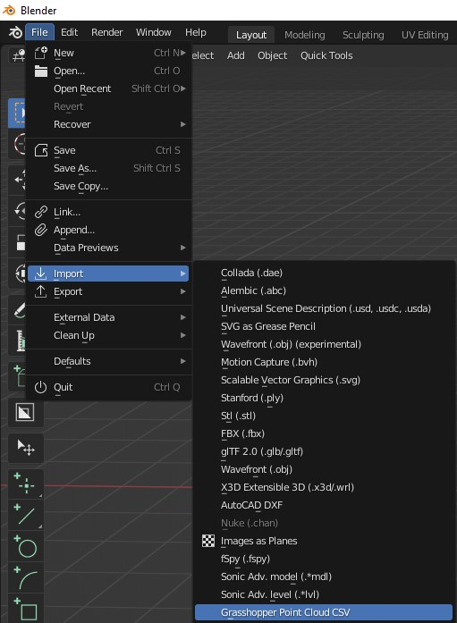
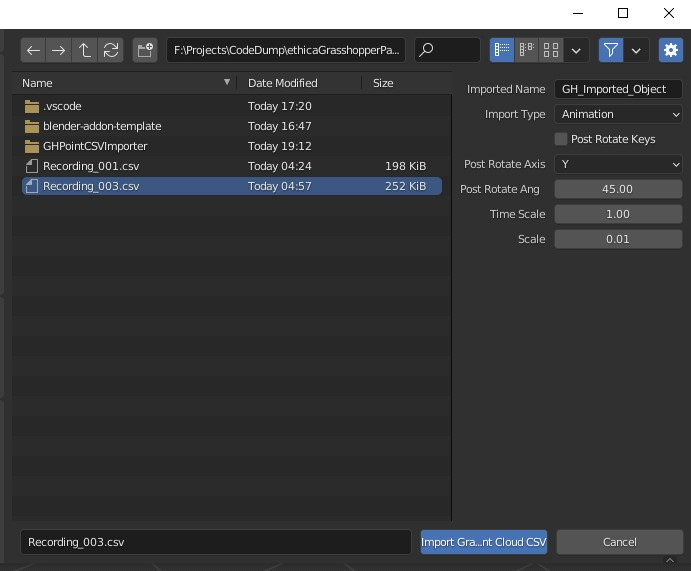
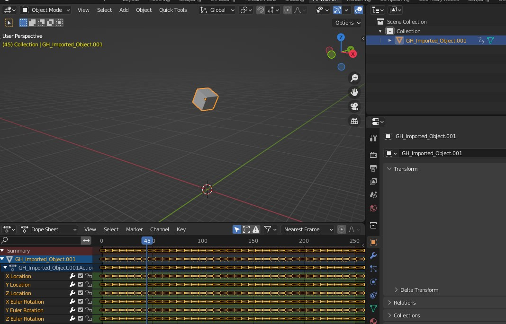
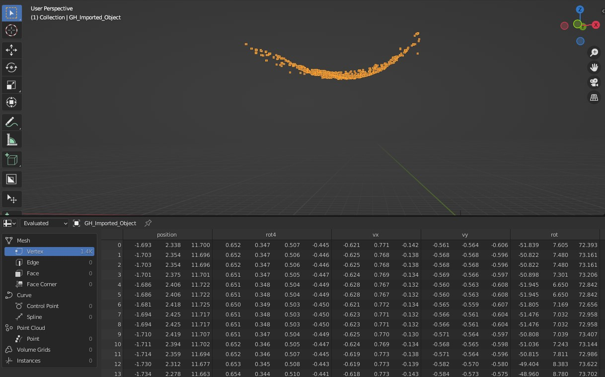

# Description
Import a CSV file from Grasshopper with a Point Cloud as a point cloud or as keyframed animation.

# Formatting
Import a Grasshopper Point Cloud CSV file formatted with the headers and values like so:
```csv
TIMESTAMP,ORIGIN_X,ORIGIN_Y,ORIGIN_Z,XAXIS_X,XAXIS_Y,XAXIS_Z,YAXIS_X,YAXIS_Y,YAXIS_Z,STATE
```
```csv
ORIGIN_X,ORIGIN_Y,ORIGIN_Z = Vecator3(x,y,z) Object Position
```






# Controls

## Imported Name
### Default
GH_Imported_Object
### Description
Name of the new object created, point cloud or cube

## Import Type
### Description
Choose between two import types
### Items
    ('OPT_A', "Animation", "Import and apply animation to a cube for later processing"),
    ('OPT_B', "Point Cloud", "Import as a Point Cloud"),
    default='OPT_A',
### Default
OPT_A

## Post Rotate Keys
### Description
Rotate the imported keyframe data per frame
### Default
True

## Post Rotate Axis
### Description
Axis to post rotate the imported keyframe data
### Items
        ('OPT_X', "X", "Rotate the imported keyframe data on the X axis"),
        ('OPT_Y', "Y", "Rotate the imported keyframe data on the Y axis"),
        ('OPT_Z', "Z", "Rotate the imported keyframe data on the Z axis"),
### Default
OPT_Y

## Post Rotate Angle (Degrees)",
### Description
The angle to rotate the imported keyframe data per frame
### Default
45


## Smooth Frames Size
### Description
The number of frames to average for smoothing
### Options
{'HIDDEN'}
### Default
1


## Time Scale
### DescriptionTime/Speed Scale for the imported keyframe data
### Default
1